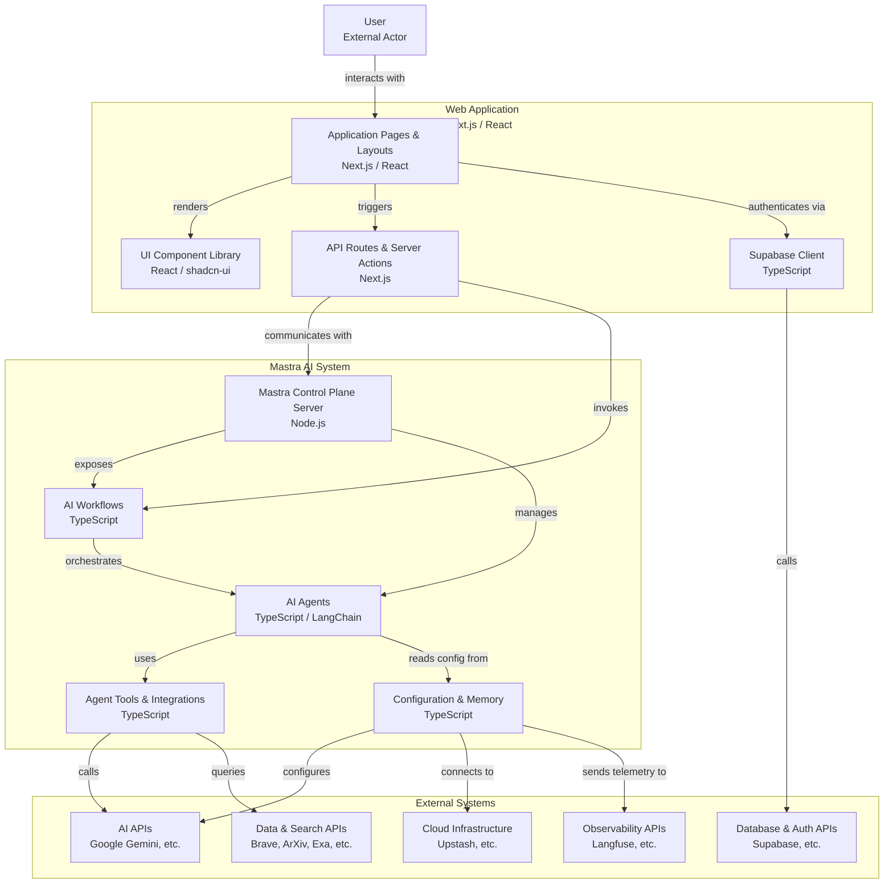

# System Context

## I am working on a software system with the following directory structure, architecture, and analyzed files:

## Directory Structure
```
deanmachines-rsc
├── docs
│   ├── AI_ASSISTANT_CONTEXT
│   │   ├── assistant_notes.md
│   │   ├── meeting_notes.md
│   │   ├── project_overview.md
│   │   ├── README.md
│   │   └── user_preferences.md
│   ├── components
│   │   └── README.md
│   └── UPSTASH_INTEGRATION_ANALYSIS.md
├── public
│   ├── Adobe Express - file (1).png
│   ├── Adobe Express - file (2).PNG
│   ├── Adobe Express - file (3).PNG
│   ├── Adobe Express - file.png
│   ├── Adobe Express -small.png
│   ├── avatar.ico
│   ├── avatar.png
│   ├── avatar.svg
│   ├── download (1).jpg
│   ├── download.jpg
│   ├── file.svg
│   ├── globe.svg
│   ├── logo-main.jpg
│   ├── logo.png
│   ├── next.svg
│   ├── Remove background project.png
│   ├── unnamed (1).png
│   ├── unnamed.jpg
│   ├── unnamed.png
│   ├── vercel.svg
│   └── window.svg
├── src
│   ├── app
│   │   ├── (playground)
│   │   │   ├── codegraph
│   │   │   │   └── page.tsx
│   │   │   ├── generative-ui
│   │   │   │   └── page.tsx
│   │   │   ├── multi-agent
│   │   │   │   └── page.tsx
│   │   │   ├── playground
│   │   │   │   └── page.tsx
│   │   │   ├── research
│   │   │   │   ├── Main.tsx
│   │   │   │   └── page.tsx
│   │   │   ├── settings
│   │   │   │   └── page.tsx
│   │   │   └── layout.tsx
│   │   ├── (public)
│   │   │   ├── about
│   │   │   │   └── page.tsx
│   │   │   ├── contact
│   │   │   │   └── page.tsx
│   │   │   ├── demo
│   │   │   │   └── page.tsx
│   │   │   ├── docs
│   │   │   │   ├── architecture
│   │   │   │   │   └── page.mdx
│   │   │   │   ├── concepts
│   │   │   │   │   └── page.mdx
│   │   │   │   ├── copilotkit
│   │   │   │   │   └── setup
│   │   │   │   │       └── page.mdx
│   │   │   │   ├── installation
│   │   │   │   │   └── page.mdx
│   │   │   │   ├── mastra
│   │   │   │   │   ├── agents
│   │   │   │   │   │   └── page.mdx
│   │   │   │   │   ├── memory
│   │   │   │   │   │   └── page.mdx
│   │   │   │   │   ├── tools
│   │   │   │   │   │   └── page.mdx
│   │   │   │   │   └── workflows
│   │   │   │   │       └── page.mdx
│   │   │   │   ├── layout.tsx
│   │   │   │   └── page.mdx
│   │   │   ├── features
│   │   │   │   └── page.tsx
│   │   │   └── solutions
│   │   │       └── page.tsx
│   │   ├── action
│   │   │   └── git
│   │   │       ├── action.ts
│   │   │       ├── form.tsx
│   │   │       └── page.tsx
│   │   ├── api
│   │   │   └── copilotkit
│   │   │       └── route.ts
│   │   ├── auth
│   │   │   ├── auth-code-error
│   │   │   │   └── page.tsx
│   │   │   └── callback
│   │   │       └── route.ts
│   │   ├── error
│   │   │   ├── confirm
│   │   │   │   └── route.ts
│   │   │   └── page.tsx
│   │   ├── login
│   │   │   ├── actions.ts
│   │   │   └── page.tsx
│   │   ├── private
│   │   │   └── page.tsx
│   │   ├── test
│   │   │   ├── action.ts
│   │   │   ├── form.tsx
│   │   │   └── page.tsx
│   │   ├── favicon.ico
│   │   ├── globals.css
│   │   ├── layout.tsx
│   │   └── page.tsx
│   ├── components
│   │   ├── copilotkit
│   │   │   ├── Actions.tsx
│   │   │   ├── AICodeGenerator.tsx
│   │   │   ├── AssistantMessage.tsx
│   │   │   ├── Button.tsx
│   │   │   ├── CodeGraphChatModal.tsx
│   │   │   ├── CodeGraphContext.tsx
│   │   │   ├── ComponentLibrary.tsx
│   │   │   ├── CustomChatInterface.tsx
│   │   │   ├── GenerativeUICanvas.tsx
│   │   │   ├── Header.tsx
│   │   │   ├── Input.tsx
│   │   │   ├── InteractiveCodeGraph.tsx
│   │   │   ├── MDXEditor.tsx
│   │   │   ├── Messages.tsx
│   │   │   ├── Suggestions.tsx
│   │   │   ├── UserMessage.tsx
│   │   │   └── Window.tsx
│   │   ├── effects
│   │   │   ├── lightning-cursor.tsx
│   │   │   └── LightningBackground.tsx
│   │   ├── landing
│   │   │   ├── AboutSection.tsx
│   │   │   ├── FeaturesSection.tsx
│   │   │   ├── LandingPageSection.tsx
│   │   │   ├── SolutionsSection.tsx
│   │   │   └── TopNavbar.tsx
│   │   ├── researchCanvas
│   │   │   ├── AddResourceDialog.tsx
│   │   │   ├── EditResourceDialog.tsx
│   │   │   ├── ModelSelector.tsx
│   │   │   ├── Progress.tsx
│   │   │   ├── ResearchCanvas.tsx
│   │   │   └── Resources.tsx
│   │   ├── ui
│   │   │   ├── accordion.tsx
│   │   │   ├── alert-dialog.tsx
│   │   │   ├── alert.tsx
│   │   │   ├── aspect-ratio.tsx
│   │   │   ├── avatar.tsx
│   │   │   ├── badge.tsx
│   │   │   ├── breadcrumb.tsx
│   │   │   ├── button.tsx
│   │   │   ├── calendar.tsx
│   │   │   ├── card.tsx
│   │   │   ├── carousel.tsx
│   │   │   ├── chart.tsx
│   │   │   ├── checkbox.tsx
│   │   │   ├── collapsible.tsx
│   │   │   ├── command.tsx
│   │   │   ├── context-menu.tsx
│   │   │   ├── dialog.tsx
│   │   │   ├── drawer.tsx
│   │   │   ├── dropdown-menu.tsx
│   │   │   ├── form.tsx
│   │   │   ├── hover-card.tsx
│   │   │   ├── input-otp.tsx
│   │   │   ├── input.tsx
│   │   │   ├── label.tsx
│   │   │   ├── menubar.tsx
│   │   │   ├── navigation-menu.tsx
│   │   │   ├── pagination.tsx
│   │   │   ├── popover.tsx
│   │   │   ├── progress.tsx
│   │   │   ├── radio-group.tsx
│   │   │   ├── resizable.tsx
│   │   │   ├── scroll-area.tsx
│   │   │   ├── select.tsx
│   │   │   ├── separator.tsx
│   │   │   ├── sheet.tsx
│   │   │   ├── sidebar.tsx
│   │   │   ├── skeleton.tsx
│   │   │   ├── slider.tsx
│   │   │   ├── sonner.tsx
│   │   │   ├── switch.tsx
│   │   │   ├── table.tsx
│   │   │   ├── tabs.tsx
│   │   │   ├── textarea.tsx
│   │   │   ├── theme-context.tsx
│   │   │   ├── theme-switch.tsx
│   │   │   ├── toggle-group.tsx
│   │   │   ├── toggle.tsx
│   │   │   └── tooltip.tsx
│   │   ├── mdx-component.tsx
│   │   └── providers.tsx
│   ├── hooks
│   │   └── use-mobile.ts
│   ├── lib
│   │   ├── model-selector-provider.tsx
│   │   ├── tailwind-v4-utils.ts
│   │   ├── types.ts
│   │   └── utils.ts
│   ├── mastra
│   │   ├── agents
│   │   │   ├── analyzer-agent.ts
│   │   │   ├── browser-agent.ts
│   │   │   ├── code-agent.ts
│   │   │   ├── data-agent.ts
│   │   │   ├── debug-agent.ts
│   │   │   ├── design-agent.ts
│   │   │   ├── docker-agent.ts
│   │   │   ├── documentation-agent.ts
│   │   │   ├── evolve-agent.ts
│   │   │   ├── git-agent.ts
│   │   │   ├── graph-agent.ts
│   │   │   ├── index.test.ts
│   │   │   ├── index.ts
│   │   │   ├── langgraph-agent.ts
│   │   │   ├── manager-agent.ts
│   │   │   ├── marketing-agent.ts
│   │   │   ├── master-agent.ts
│   │   │   ├── processing-agent.ts
│   │   │   ├── react-enhanced-agent.ts
│   │   │   ├── research-agent.ts
│   │   │   ├── special-agent.ts
│   │   │   ├── strategizer-agent.ts
│   │   │   ├── supervisor-agent.ts
│   │   │   ├── sysadmin-agent.ts
│   │   │   ├── utility-agent.ts
│   │   │   └── weather-agent.ts
│   │   ├── config
│   │   │   ├── environment.ts
│   │   │   ├── googleProvider.ts
│   │   │   ├── index.ts
│   │   │   ├── langchainAdapter.ts
│   │   │   ├── langfuseConfig.ts
│   │   │   ├── oTelConfig.ts
│   │   │   └── upstashLogger.ts
│   │   ├── deanmachines-mcp
│   │   │   ├── mcpServer.ts
│   │   │   └── README.md
│   │   ├── evals
│   │   │   ├── answerRelevancy.ts
│   │   │   ├── bias.ts
│   │   │   ├── completeness.ts
│   │   │   ├── contentSimilarity.ts
│   │   │   ├── contextPosition.new.ts
│   │   │   ├── contextPrecision.ts
│   │   │   ├── contextualRecall.ts
│   │   │   ├── customEval.ts
│   │   │   ├── faithfulness.ts
│   │   │   ├── hallucination.ts
│   │   │   ├── keywordCoverage.ts
│   │   │   ├── promptAlignment.ts
│   │   │   ├── summarization.ts
│   │   │   ├── textualDifference.ts
│   │   │   ├── toneConsistency.ts
│   │   │   ├── toxicity.ts
│   │   │   └── wordInclusion.ts
│   │   ├── networks
│   │   │   ├── base-network.ts
│   │   │   └── dean-machines-network.ts
│   │   ├── tools
│   │   │   ├── agentic
│   │   │   │   ├── arxiv.ts
│   │   │   │   ├── bing-client.ts
│   │   │   │   ├── brave-search.ts
│   │   │   │   ├── diffbot-client.ts
│   │   │   │   ├── exa-client.ts
│   │   │   │   ├── google-docs-client.ts
│   │   │   │   ├── hacker-news-client.ts
│   │   │   │   ├── mastra.ts
│   │   │   │   ├── paginate.ts
│   │   │   │   ├── polygon.ts
│   │   │   │   ├── reddit.ts
│   │   │   │   ├── serper-client.ts
│   │   │   │   ├── utils.ts
│   │   │   │   ├── wikibase.ts
│   │   │   │   └── wikidata-client.ts
│   │   │   ├── chunker-tool.ts
│   │   │   ├── code-execution-tool.ts
│   │   │   ├── code-execution-wrapper-tool.ts
│   │   │   ├── file-manager-tools.ts
│   │   │   ├── freestyle-sandbox-tool.ts
│   │   │   ├── git-tool.ts
│   │   │   ├── graphRAG.ts
│   │   │   ├── index.ts
│   │   │   ├── mcp.ts
│   │   │   ├── mem0-tool.ts
│   │   │   ├── rerank-tool.ts
│   │   │   ├── stock-tools.ts
│   │   │   ├── tavily.ts
│   │   │   ├── vectorQueryTool.ts
│   │   │   ├── weather-tool.ts
│   │   │   └── web-browser-tools.ts
│   │   ├── utility
│   │   │   ├── eslintcc.d.ts
│   │   │   └── jsinspect-plus.d.ts
│   │   ├── vworkflows
│   │   │   └── vnext-workflow.ts
│   │   ├── workflows
│   │   │   ├── code-graph-maker-advanced.ts
│   │   │   ├── code-graph-maker.ts
│   │   │   ├── full-stack-development-workflow.ts
│   │   │   ├── index.ts
│   │   │   ├── research-analysis-workflow.ts
│   │   │   └── weather-workflow.ts
│   │   ├── agentMemory.ts
│   │   ├── index.ts
│   │   ├── memory.ts
│   │   └── upstashMemory.ts
│   └── utility
│       └── supabase
│           ├── client.ts
│           ├── middleware.ts
│           └── server.ts
├── CHANGELOG.md
├── codeviz_report_map_out_how_all_my_files_wire_together_for_each_fi_2025-06-27T12-47-43.md
├── components.json
├── eslint.config.mjs
├── GEMINI.md
├── globalSetup.ts
├── graphs.json
├── image.png
├── log.txt
├── middleware.ts
├── next.config.ts
├── package-lock.json
├── package.json
├── postcss.config.mjs
├── README.md
├── repomix.config.json
├── test-mcp-server.ts
├── testSetup.ts
├── tsconfig.json
└── vitest.config.ts

```

## Mermaid Diagram


## Analyzed Files

- `src/mastra/index.ts`: This file initializes the Mastra framework, setting up networks, agents, and logging. It uses Pino for local logging and Langfuse for telemetry.