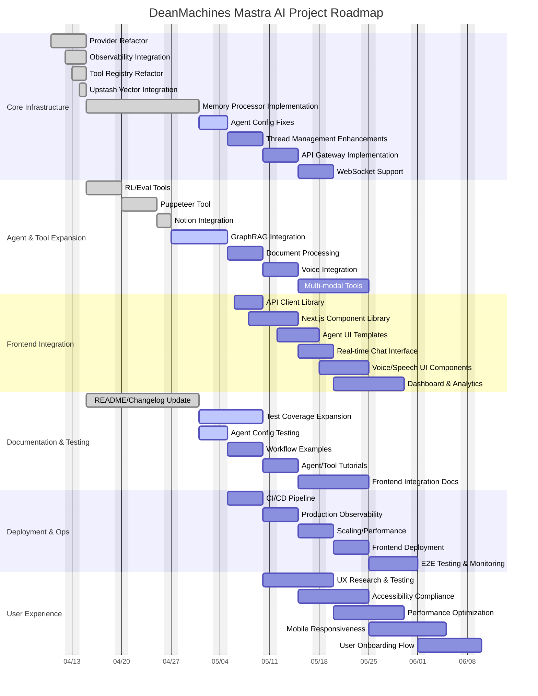

# DeanMachines Mastra AI Workspace

Welcome to the **DeanMachines Mastra AI Workspace**! This monorepo contains the backend, agent, and tool infrastructure for the DeanMachines AI platform, built on the Mastra framework. This README provides a comprehensive overview, technical context, and actionable notes for both human contributors and AI assistants.

---

## Table of Contents

- [DeanMachines Mastra AI Workspace](#deanmachines-mastra-ai-workspace)
  - [Table of Contents](#table-of-contents)
  - [Project Overview](#project-overview)
  - [Workspace Structure](#workspace-structure)
  - [Directory Structure](#directory-structure)
  - [Key Concepts](#key-concepts)
  - [Architecture Overview (Mermaid)](#architecture-overview-mermaid)
  - [Agent Types](#agent-types)
  - [Tooling System](#tooling-system)
  - [Memory \& Database](#memory--database)
  - [Observability \& Tracing](#observability--tracing)
  - [Voice \& Speech Integration](#voice--speech-integration)
  - [Model Providers](#model-providers)
  - [Eval \& RL Pipeline](#eval--rl-pipeline)
  - [Vertex AI \& LLM Integration Details](#vertex-ai--llm-integration-details)
  - [Development \& Conventions](#development--conventions)
  - [Changelog](#changelog)
  - [Notes for AI Assistants](#notes-for-ai-assistants)
  - [AI Assistant Notes (For GitHub Copilot / Collaborators)](#ai-assistant-notes-for-github-copilot--collaborators)
  - [Additional AI Assistant Guidance (2025-05-01)](#additional-ai-assistant-guidance-2025-05-01)
  - [Current Progress (as of 2025-04-16)](#current-progress-as-of-2025-04-16)
  - [Project Roadmap (Gantt Diagram)](#project-roadmap-gantt-diagram)
  - [Current Benchmarks (2025-04-15)](#current-benchmarks-2025-04-15)
  - [Final Notes](#final-notes)
  - [Getting Help](#getting-help)
  - [Large Token Context Support](#large-token-context-support)
    - [Memory Processors](#memory-processors)
      - [How to Use](#how-to-use)
      - [Custom Memory Processors](#custom-memory-processors)

---

## Project Overview

This workspace powers DeanMachines' advanced AI agents, leveraging the [Mastra](https://github.com/agentic-ai/mastra) framework. It is designed for:

- Multi-agent orchestration (research, RL, writing, coding, etc.)
- Reinforcement learning (RL) and feedback-driven optimization
- Tool-augmented LLMs (Google, Vertex AI, OpenAI, etc.)
- Memory persistence and semantic search
- Observability with SigNoz and OpenTelemetry
- Modular, extensible agent and tool design

---

## Workspace Structure

```bash
deanmachines-front/
functions/
├── src/
│   ├── mastra/
│   │   ├── agents/         # Agent configs, implementations, and types
│   │   ├── tools/          # All tool modules (search, evals, RL, etc.)
│   │   ├── database/       # Memory, vector, and cache adapters
│   │   ├── services/       # Integrations (tracing, observability, search, etc.)
│   │   ├── utils/          # Shared utilities (thread manager, diagnostics, etc.)
│   │   ├── voice/          # Voice and speech integrations
│   │   ├── workflows/      # Workflow orchestration and factories
│   │   ├── types.ts        # Shared type definitions
│   │   └── index.ts        # Mastra entrypoint
│   ├── index.ts            # Main entrypoint
│   └── ...
├── package.json
├── tsconfig.json
├── CHANGELOG.md
├── README.md               # (This file)
└── ...

```

## Directory Structure

```bash
.cursor/
  mcp.json
src/
  mastra/
    agents/
      config/
        agentic.config.ts
        analyst.config.ts
        architect.config.ts
        codeDocumenter.config.ts
        coder.config.ts
        config.types.ts
        copywriter.config.ts
        dataManager.config.ts
        debugger.config.ts
        index.ts
        marketResearch.config.ts
        model.utils.ts
        provider.utils.ts
        research.config.ts
        rlTrainer.config.ts
        seoAgent.config.ts
        socialMedia.config.ts
        uiUxCoder.config.ts
        writer.config.ts
      agentic.agent.ts
      analyst.agent.ts
      architect.agent.ts
      base.agent.ts
      codeDocumenter.agent.ts
      coder.agent.ts
      copywriter.agent.ts
      dataManager.agent.ts
      debugger.agent.ts
      index.ts
      marketResearch.agent.ts
      research.agent.ts
      rlTrainer.agent.ts
      seoAgent.agent.ts
      socialMedia.agent.ts
      uiUxCoder.agent.ts
      writer.agent.ts
    database/
      examples.ts
      index.ts
      vector-store.ts
    hooks/
      index.ts
    integrations/
      index.ts
    services/
      exasearch.ts
      hyperbrowser.ts
      index.ts
      langchain.ts
      langfuse.ts
      langsmith.ts
      signoz.ts
      tracing.ts
      types.ts
    tools/
      ai-sdk.ts
      arxiv.ts
      bing-client.ts
      brave-search.ts
      calculator.ts
      contentTools.ts
      document-tools.ts
      document.ts
      e2b.ts
      evals.ts
      exasearch.ts
      genkit.ts
      github.ts
      google-docs-client.ts
      google-drive-client.ts
      google-search.ts
      graphRag.ts
      hyper-functionCalls.ts
      index.ts
      jina-client.ts
      llamaindex.ts
      llmchain.ts
      mastra.ts
      mcp.ts
      mcptools.ts
      memoryQueryTool.ts
      midjourney-client.ts
      notion-client.ts
      notion.ts
      paginate.ts
      readwrite.ts
      rlFeedback.ts
      rlReward.ts
      stdlib.ts
      tavily.ts
      tracingTools.ts
      types.ts
      utils.ts
      vectorquerytool.ts
      wikibase.ts
      wikidata-client.ts
    utils/
      index.ts
      memory-diagnostics.ts
      thread-manager.ts
    voice/
      elevenlabs.ts
      googlevoice.ts
      index.ts
    workflows/
      Networks/
        agentNetwork.ts
        knowledgeWorkMoE.network.ts
        productLaunchNetwork.ts
      index.ts
      workflowFactory.ts
    index.ts
    types.ts
.eslintrc.js
.gitignore
Agent-Fails.md
CHANGELOG.md
package.json
README.md
```

---

## Key Concepts

- **Agent**: An autonomous LLM-powered entity with a specific configuration, memory, and toolset.
- **Tool**: A modular function (search, eval, RL, etc.) that agents can call to augment their capabilities.
- **Memory**: Persistent storage for agent conversations, context, and semantic recall.
- **Model Provider**: Abstraction for LLM backends (Google, Vertex AI, OpenAI, etc.).
- **Observability**: Integrated tracing and metrics via SigNoz and OpenTelemetry.

---

## Architecture Overview (Mermaid)

```mermaid
graph TD

    subgraph 12854["External Systems"]
        12888["LLM Providers<br>External Service (Google, OpenAI, Anthropic, Ollama)"]
        12889["Observability Services<br>External Service (LangSmith, Langfuse, Signoz)"]
        12890["Vector Databases<br>External Service (Pinecone, Supabase/PgVector, Redis/Upstash, LibSQL)"]
        12891["Search Services<br>External Service (Google, Brave, Exa, Tavily, ArXiv)"]
        12892["Data/Knowledge Services<br>External Service (Wikipedia, Wikidata, Notion, GitHub, Reddit, Polygon)"]
        12893["Web Automation Services<br>External Service (Puppeteer Driver, Firecrawl API, Hyperbrowser)"]
        12894["Code Sandbox Services<br>External Service (E2B)"]
        12895["Voice Services<br>External Service (Google TTS/STT, ElevenLabs)"]
        12896["Image Generation Services<br>External Service (Midjourney)"]
        12897["Caching Services<br>External Service (Redis/Upstash)"]
        12898["Logging Services<br>External Service (Upstash Logs)"]
        12899["Collaboration Platform<br>External Service (GitHub)"]
        12900["Local File System<br>Operating System Resource"]
    end
    subgraph 12855["Mastra Agent Framework"]
        subgraph 12856["Core Application<br>TypeScript"]
            12863["Mastra Core<br>TypeScript"]
            12864["Agent Hooks<br>TypeScript"]
            12865["Utilities<br>TypeScript"]
            12887["Specific Integrations<br>TypeScript"]
            subgraph 12857["Voice Subsystem<br>TypeScript"]
                12886["Voice Synthesizer<br>TypeScript"]
            end
            subgraph 12858["Service Clients<br>TypeScript"]
                12883["LLM Wrappers<br>TypeScript"]
                12884["Observability Clients<br>TypeScript"]
                12885["External Service Clients<br>TypeScript"]
            end
            subgraph 12859["Data Management Subsystem<br>TypeScript"]
                12879["Memory Manager<br>TypeScript"]
                12880["Vector Store Adapters<br>TypeScript"]
                12881["Logging Adapters<br>TypeScript"]
                12882["Storage Adapters<br>TypeScript"]
            end
            subgraph 12860["Tools Subsystem<br>TypeScript"]
                12872["Tool Registry & Helpers<br>TypeScript"]
                12873["Web & Data Retrieval Tools<br>TypeScript"]
                12874["Knowledge Management Tools<br>TypeScript"]
                12875["Execution & File Tools<br>TypeScript"]
                12876["AI Integration Tools<br>TypeScript"]
                12877["Evaluation & RL Tools<br>TypeScript"]
                12878["Utility & Specialized Tools<br>TypeScript"]
            end
            subgraph 12861["Workflows Subsystem<br>TypeScript"]
                12869["Workflow Engine<br>TypeScript"]
                12870["Workflow Definitions<br>TypeScript"]
                12871["Agent Networks<br>TypeScript"]
            end
            subgraph 12862["Agents Subsystem<br>TypeScript"]
                12866["Agent Definitions<br>TypeScript"]
                12867["Agent Configuration<br>TypeScript"]
                12868["Base Agent Logic<br>TypeScript"]
                %% Edges at this level (grouped by source)
                12866["Agent Definitions<br>TypeScript"] --> 12867["Agent Configuration<br>TypeScript"]
                12866["Agent Definitions<br>TypeScript"] --> 12868["Base Agent Logic<br>TypeScript"]
            end
            %% Edges at this level (grouped by source)
            12866["Agent Definitions<br>TypeScript"] --> 12864["Agent Hooks<br>TypeScript"]
            12866["Agent Definitions<br>TypeScript"] --> 12872["Tool Registry & Helpers<br>TypeScript"]
            12866["Agent Definitions<br>TypeScript"] --> 12879["Memory Manager<br>TypeScript"]
            12866["Agent Definitions<br>TypeScript"] --> 12883["LLM Wrappers<br>TypeScript"]
            12866["Agent Definitions<br>TypeScript"] --> 12886["Voice Synthesizer<br>TypeScript"]
            12871["Agent Networks<br>TypeScript"] --> 12866["Agent Definitions<br>TypeScript"]
        end
    end
    %% Edges at this level (grouped by source)
    12887["Specific Integrations<br>TypeScript"] -->|interacts with| 12899["Collaboration Platform<br>External Service (GitHub)"]
    12886["Voice Synthesizer<br>TypeScript"] -->|uses| 12895["Voice Services<br>External Service (Google TTS/STT, ElevenLabs)"]
    12876["AI Integration Tools<br>TypeScript"] -->|uses| 12888["LLM Providers<br>External Service (Google, OpenAI, Anthropic, Ollama)"]
    12876["AI Integration Tools<br>TypeScript"] -->|uses| 12890["Vector Databases<br>External Service (Pinecone, Supabase/PgVector, Redis/Upstash, LibSQL)"]
    12877["Evaluation & RL Tools<br>TypeScript"] -->|uses| 12888["LLM Providers<br>External Service (Google, OpenAI, Anthropic, Ollama)"]
    12877["Evaluation & RL Tools<br>TypeScript"] -->|uses| 12889["Observability Services<br>External Service (LangSmith, Langfuse, Signoz)"]
    12878["Utility & Specialized Tools<br>TypeScript"] -->|uses| 12889["Observability Services<br>External Service (LangSmith, Langfuse, Signoz)"]
    12878["Utility & Specialized Tools<br>TypeScript"] -->|uses| 12896["Image Generation Services<br>External Service (Midjourney)"]
    12878["Utility & Specialized Tools<br>TypeScript"] -->|uses| 12900["Local File System<br>Operating System Resource"]
    12874["Knowledge Management Tools<br>TypeScript"] -->|uses| 12890["Vector Databases<br>External Service (Pinecone, Supabase/PgVector, Redis/Upstash, LibSQL)"]
    12874["Knowledge Management Tools<br>TypeScript"] -->|uses| 12892["Data/Knowledge Services<br>External Service (Wikipedia, Wikidata, Notion, GitHub, Reddit, Polygon)"]
    12874["Knowledge Management Tools<br>TypeScript"] -->|uses| 12900["Local File System<br>Operating System Resource"]
    12873["Web & Data Retrieval Tools<br>TypeScript"] -->|uses| 12891["Search Services<br>External Service (Google, Brave, Exa, Tavily, ArXiv)"]
    12873["Web & Data Retrieval Tools<br>TypeScript"] -->|uses| 12892["Data/Knowledge Services<br>External Service (Wikipedia, Wikidata, Notion, GitHub, Reddit, Polygon)"]
    12873["Web & Data Retrieval Tools<br>TypeScript"] -->|uses| 12893["Web Automation Services<br>External Service (Puppeteer Driver, Firecrawl API, Hyperbrowser)"]
    12875["Execution & File Tools<br>TypeScript"] -->|uses| 12894["Code Sandbox Services<br>External Service (E2B)"]
    12875["Execution & File Tools<br>TypeScript"] -->|uses| 12900["Local File System<br>Operating System Resource"]
    12883["LLM Wrappers<br>TypeScript"] -->|interacts with| 12888["LLM Providers<br>External Service (Google, OpenAI, Anthropic, Ollama)"]
    12884["Observability Clients<br>TypeScript"] -->|sends telemetry to| 12889["Observability Services<br>External Service (LangSmith, Langfuse, Signoz)"]
    12885["External Service Clients<br>TypeScript"] -->|interacts with| 12891["Search Services<br>External Service (Google, Brave, Exa, Tavily, ArXiv)"]
    12885["External Service Clients<br>TypeScript"] -->|interacts with| 12893["Web Automation Services<br>External Service (Puppeteer Driver, Firecrawl API, Hyperbrowser)"]
    12880["Vector Store Adapters<br>TypeScript"] -->|uses embeddings from| 12888["LLM Providers<br>External Service (Google, OpenAI, Anthropic, Ollama)"]
    12880["Vector Store Adapters<br>TypeScript"] -->|stores/retrieves vectors via| 12890["Vector Databases<br>External Service (Pinecone, Supabase/PgVector, Redis/Upstash, LibSQL)"]
    12882["Storage Adapters<br>TypeScript"] -->|stores data via| 12890["Vector Databases<br>External Service (Pinecone, Supabase/PgVector, Redis/Upstash, LibSQL)"]
    12882["Storage Adapters<br>TypeScript"] -->|caches data via| 12897["Caching Services<br>External Service (Redis/Upstash)"]
    12881["Logging Adapters<br>TypeScript"] -->|logs to| 12898["Logging Services<br>External Service (Upstash Logs)"]
    12881["Logging Adapters<br>TypeScript"] -->|logs to| 12900["Local File System<br>Operating System Resource"]
```



---

## Agent Types

Agents are defined in `src/mastra/agents/` and configured via TypeScript config files. Each agent has:

- A unique `id`, `name`, and `description`
- A `modelConfig` specifying the LLM provider/model (see `config.types.ts`)
- A set of `toolIds` (referencing tools in the registry)
- Optional response validation and error handling hooks
- Example agents: `rlTrainer.agent.ts`, `research.agent.ts`, `writer.agent.ts`, `coder.agent.ts`, etc.
- RL Trainer Agent is specialized for feedback collection, analysis, and policy optimization (see `rlTrainer.agent.ts` and `rlTrainer.config.ts`)

---

## Tooling System

Tools are modular, reusable functions that agents can invoke. They are defined in `src/mastra/tools/` and registered in the main tool barrel (`tools/index.ts`).

- **Types of Tools:**
  - Search: Brave, Google, Tavily, Exa, Bing, etc.
  - RL Feedback & Reward: collect, analyze, optimize
  - Evals: completeness, relevancy, faithfulness, context precision, etc. (Vertex LLM + heuristics)
  - Content & Document: formatting, embedding, summarization
  - Utility: calculator, file I/O, GitHub, GraphRag, etc.
- **Tool Registration:**
  - All tools are registered and discoverable via `allTools`, `allToolsMap`, and `toolGroups` in `tools/index.ts`.
  - Output schemas are patched for type safety using `ensureToolOutputSchema`.
  - Extra tools (e.g., getMainBranchRef) are separated from core tools for clarity.
- **Adding a Tool:**
  - Implement the tool in `tools/`
  - Import and register in `tools/index.ts`
  - Patch output schema if needed
  - Add toolId to agent config as needed

---

## Memory & Database

- **LibSQL** is used for persistent memory storage and vector search (see `database/index.ts`).
- **Redis** is available for caching and fast key-value operations.
- **Memory** is injected into agents for context recall and thread management (see `sharedMemory` in `database/index.ts`).
- **MemoryConfig** allows tuning of lastMessages, semanticRecall, workingMemory, and thread title generation.

---

## Observability & Tracing

- **SigNoz** and **OpenTelemetry** are integrated for
  distributed tracing and metrics (see `services/signoz.ts` and
  `services/tracing.ts`).
- All tools and agents create spans for major operations.
- Latency, token usage, and error status are recorded for all
  LLM and tool calls.
- **Base Agent** (`base.agent.ts`) now:
  - Calls `initializeDefaultTracing()` at startup to auto‐instrument.
  - Invokes `initSigNoz()` to set up an OTLP exporter, tracer, and meter.
  - Creates named spans around agent lifecycle events
    (`agent.create`, `agent.debug/info/warn/error`).
  - Records two custom metrics:
    - `agent.creation.count`
    - `agent.creation.latency_ms`
- **Logging Transports** in `base.agent.ts`:
  - `consoleLogger` (in‐process, timestamped console output)
  - `fileLogger` (JSON‑line file output; auto‑creates `./logs/mastra.log`)
  - `upstashLogger` (pushes logs to Upstash Redis via `UpstashTransport`)
  - These three are wired into a unified `logger` API so every call
    writes to all channels.

## Voice & Speech Integration

- The `voice/` folder contains two factories:
  - `createGoogleVoice()` (CompositeVoice + Google TTS/STT + tool injection)
  - `createElevenLabsVoice()` (ElevenLabs TTS + tool injection)
- **Voice stub in Base Agent** (`base.agent.ts`):
  - The import and instantiation of `createGoogleVoice()` are present
    but commented out.
  - Event hooks (`voice.connect()`, `voice.on("listen")`, `voice.on("speaker")`)
    are scaffolded to demonstrate how real‐time STT/TTS would be wired.
  - Voice support is **half‑complete**; to enable:
    1. Un‑comment the `voice` import and constructor lines.
    2. Implement or enable a real‑time streaming provider (Google streaming API).
    3. Wire in a microphone input (e.g. `getMicrophoneStream()`) and playback.
- All Agents (`new Agent({...})`) can accept a `voice` instance.
  When enabled, methods such as:
  - `agent.speak(text)`
  - `agent.listen(audioStream)`
  - `agent.getSpeakers(languageCode)`
  - `agent.send()` / `agent.answer()`
  - `agent.on(event, handler)` and `agent.off(event, handler)`
  - `agent.close()`
  will be available.

---

## Model Providers

- **Google** and **Vertex AI** are the primary LLM providers (see `agents/config/model.utils.ts`).
- Model instantiation is abstracted via utility functions (`createGoogleModel`, `createVertexModel`, etc.).
- Provider configuration is managed in `provider.utils.ts`.
- Model selection is configurable via environment variables and agent configs.
- Default models and capabilities are defined in `config.types.ts`.

---

## Eval & RL Pipeline

- **Eval tools** (in `tools/evals.ts`) are production-grade, using Vertex AI for LLM-based scoring and robust fallback heuristics.
- **RL Feedback tools** (in `tools/rlFeedback.ts`) collect, analyze, and apply feedback for agent improvement.
- All evals and RL tools output latency, model, and token usage for observability.
- RL Trainer agent uses a structured methodology for observation, hypothesis, experimentation, analysis, implementation, and validation.

---

## Vertex AI & LLM Integration Details

- **Vertex AI is integrated using the @ai-sdk/google-vertex package.**
- **Model instantiation:**
  - Use `createVertexModel(modelId, projectId?, location?, options?)` from `src/mastra/agents/config/model.utils.ts`.
  - Example: `const model = createVertexModel("models/gemini-2.0-pro");`
- **Text generation:**
  - Use the `generateText` function from the `ai` package (aliased as `import { generateText } from "ai";`).
  - Example usage in a tool:

    ```typescript
    const result = await generateText({
      model,
      messages: [
        { role: "user", content: prompt }
      ]
    });
    ```

  - The result contains `.text` (the LLM output) and `.usage` (token counts, etc).
- **Prompting:**
  - Prompts are constructed with clear instructions and a request for JSON output.
  - Always parse the LLM output as JSON, and fallback to heuristics if parsing fails.
- **Model/config override:**
  - The model ID and config can be overridden via environment variables or tool input.
- **LLM output schema:**
  - All eval tools output: `score`, `explanation`, `latencyMs`, `model`, `tokens`, `success`, and `error` (if any).

---

## Development & Conventions

- **TypeScript** is used throughout for type safety and maintainability.
- **Zod** is used for schema validation of tool inputs/outputs.
- **Changelog** is maintained in `CHANGELOG.md` with semantic versioning.
- **Testing**: (Add your test strategy here if applicable)
- **Coding Standards**: Follow Mastra and DeanMachines conventions for modularity, error handling, and observability.
- **Windows OS**: This workspace is developed and tested on Windows (see context section).

---

## Changelog

See [CHANGELOG.md](./CHANGELOG.md) for a detailed history of changes, releases, and improvements.

---

## Notes for AI Assistants

- **Workspace Context:** This is a TypeScript monorepo for backend AI agent orchestration, using Mastra as the core framework. All agent, tool, and memory logic is in `src/mastra/`.
- **Tool Registration:** Always register new tools in `tools/index.ts` and patch output schemas. Use `ensureToolOutputSchema` for type safety.
- **Agent Configs:** Agent configs are in `agents/` and use the `BaseAgentConfig` type. RL Trainer agent is a canonical example.
- **Memory:** Use `sharedMemory` from `database/index.ts` for agent memory. Memory is LibSQL-backed and supports semantic recall.
- **Tracing:** All major operations should create spans using SigNoz or OpenTelemetry. See `services/signoz.ts` for span helpers.
- **Model Providers:** Use `createGoogleModel` or `createVertexModel` for LLM instantiation. Model configs are in `config.types.ts`.
- **Eval Tools:** Use Vertex LLM for evals, fallback to heuristics if LLM fails. Always output latency, model, and tokens.
- **Windows:** Paths and scripts may use Windows conventions.
- **Mermaid Diagrams:** Update diagrams if you add new agent types, tools, or change architecture.
- **Changelog:** Update `CHANGELOG.md` for all significant changes.
- **Linting & Error Checking:**
  - After editing any file, always run lint/type checks and fix errors before proceeding.
  - Use the `get_errors` tool after every file edit.
  - If you add or change a tool, validate its registration and schema.
- **If in doubt:** Ask for more context or check this README and the codebase structure.
- **Self-Reminder:**
  - Always gather context before making changes.
  - Prefer semantic search for codebase exploration.
  - Never assume tool registration—verify in `tools/index.ts`.
  - Document all new patterns and integrations here for future reference.
- **Always follow user instructions exactly.** If you are unsure, ask for clarification before making changes.
- **Never overwrite or remove code unless explicitly instructed.** Use semantic search and context gathering to understand the impact of your edits.
- **Before editing, check for dependencies and cross-references.** Many files are interconnected (e.g., tool registration, agent configs).
- **After editing, always run lint/type checks and validate there are no errors.**
- **If you are adding or changing a tool, validate its registration and schema.**
- **Document all changes in the changelog and update the README if the project structure or workflow changes.**
- **If you are unsure about a file or function, review the codebase and ask for more context.**
- **Be careful with batch edits.** Make incremental changes and validate after each step.
- **Never assume a tool or agent is registered—verify in the appropriate index/config file.**
- **If you break something, revert your change and notify the user immediately.**

---

## AI Assistant Notes (For GitHub Copilot / Collaborators)

- **Workspace Context:** You are working within the `c:\Users\dm\Documents\Backup\DeanmachinesMastrra` directory on Windows.
- **Core Technologies:** 
  - **Framework:** Mastra AI framework (TypeScript)
  - **Type Safety:** Zod for schema validation, TypeScript for static typing
  - **Web Automation:** Puppeteer for browser automation
  - **Observability:** SigNoz/OpenTelemetry for tracing, Langfuse for LLM observability
  - **LLM Providers:** Google, OpenAI, Anthropic, Vertex AI, Ollama (all with unified interfaces)
  - **Memory:** LibSQL with 1M token context support via custom memory processors

- **Key Files to Understand:**
  - `src/mastra/tools/index.ts`: The central registry where all tools are registered and exported. **Critical for tool discovery.**
  - `src/mastra/database/index.ts`: Memory management and thread persistence with 1M token support.
  - `src/mastra/agents/config/`: Directory containing agent configurations and model utilities.
  - `src/mastra/agents/base.agent.ts`: Base agent implementation with hooks, tracing, and voice support.
  - `src/mastra/workflows/`: Orchestration of multi-agent workflows and networks.
  - `src/mastra/services/`: Shared services like tracing (`signoz.ts`) and observability (`langfuse.ts`).
  - `CHANGELOG.md`: **Check this file first** for recent changes and current development context.

- **Recent Major Additions:**
  - **Memory Processors:** Implemented in `src/mastra/database/memory-processors.ts` with 1M token support.
  - **Puppeteer Tool:** Advanced browser automation in `src/mastra/tools/puppeteerTool.ts`.
  - **Notion Integration:** Full Notion API client and tools in `src/mastra/tools/notion.ts`.
  - **Universal Provider Support:** All major LLM providers (Google, OpenAI, Anthropic, Vertex, Ollama) with unified interfaces.
  - **GraphRAG Tools:** Graph-based retrieval augmented generation tools in `src/mastra/tools/graphRag.ts`.

- **Development Workflow:**
  1. **Understand Requirements:** Clarify what needs to be built or fixed.
  2. **Check CHANGELOG.md:** Review recent changes for context.
  3. **Locate Relevant Files:** Use semantic search to find related code.
  4. **Implement Changes:** Follow existing patterns and use TypeScript + Zod.
  5. **Register Tools:** If adding tools, ensure they're registered in `tools/index.ts` with proper schema patching.
  6. **Update CHANGELOG.md:** Document your changes with file paths and implementation details.
  7. **Run Type Checks:** Ensure your changes pass TypeScript validation.

- **Common Patterns:**
  - **Tool Registration:** All tools must be registered in `tools/index.ts` and have their output schemas patched.
  - **Tracing:** Use `createTracedSpan()` for OpenTelemetry and `langfuse.createTrace()` for LLM observability.
  - **Memory:** Use `createMemory()` or `sharedMemory` for agent memory with thread management.
  - **Model Creation:** Use provider-specific utilities like `createGoogleModel()` or `createOpenAIModel()`.

---

## Additional AI Assistant Guidance (2025-05-01)

- **Memory System (New):**
  - The workspace now fully supports 1M token contexts through custom memory processors in `database/memory-processors.ts`.
  - The `createLargeContextProcessors()` function creates a chain of processors that handle token limiting, tool call filtering, and semantic clustering.
  - When working with memory, use `createMemory()` with `highTokenLimits: true` (default) to enable 1M token support.
  - Memory processors are observable via SigNoz and Langfuse for debugging and optimization.

- **Provider Support:**
  - All major LLM providers (Google, Vertex, OpenAI, Anthropic, Ollama) are supported with unified interfaces.
  - Provider configuration is strictly validated with Zod schemas in `provider.utils.ts`.
  - Model instantiation follows the correct pattern for each provider's SDK.
  - OpenAI-compatible endpoints are supported via the `"openai-compatible"` provider type.

- **Type Safety:**
  - All schemas are defined with Zod and strictly enforced at runtime.
  - Tool input/output schemas are patched and validated during registration.
  - Provider and model configs have explicit types and validation.
  - Use TypeScript type guards when accessing optional fields.

- **Error Handling:**
  - Always check for errors after async operations, especially database and LLM calls.
  - Use the singleton `langfuse` instance for tracing and scoring.
  - Wrap tool execution in try/catch and log errors with context.
  - Use the recursion guard in `thread-manager.ts` to prevent stack overflows.

- **Windows Context:**
  - This workspace is developed on Windows. Use Windows-compatible paths and commands.
  - File paths should use forward slashes (`/`) in code for cross-platform compatibility.
  - Environment variables are loaded from `.env` files and validated in `tools/index.ts`.

- **Self-Reminder Checklist:**
  - ✅ Gather context before making changes (check CHANGELOG.md first)
  - ✅ Use semantic search to explore the codebase
  - ✅ Verify tool registration in `tools/index.ts`
  - ✅ Ensure all schemas are properly defined and patched
  - ✅ Add tracing and observability to new code
  - ✅ Document changes in CHANGELOG.md
  - ✅ Run type checks after making changes
  - ✅ Test with real data when possible

---

## Current Progress (as of 2025-04-16)

- ✅ Full, type-safe support for Google, Vertex, OpenAI, Anthropic, and Ollama providers (Zod-validated, modular, future-proofed)
- ✅ All agent and tool configs refactored for modularity and type safety
- ✅ Observability (SigNoz, OpenTelemetry) fully integrated
- ✅ Standard/default models defined for all major providers (see config.types.ts)
- 🟡 Ongoing: Combing through tools—~20 tools are fully working, others are being validated and fixed
- 🟡 Ongoing: Expanding eval and RL tool coverage, improving workflow orchestration
- 🟡 Ongoing: Benchmarking LLM latency, token usage, and tracing accuracy
- 🔜 Next: Add advanced memory adapters, enhance agent self-improvement, expand documentation/testing

---

## Project Roadmap (Gantt Diagram)



---

## Current Benchmarks (2025-04-15)

| Metric                        | Goal         | Current Best | Current Mark |
|------------------------------|--------------|--------------|--------------|
| LLM Latency (Google/Vertex)  | <1.0s        | ~1.2s        | 0            |
| LLM Latency (OpenAI/Anthropic)| <1.2s        | ~1.5s        | 0            |
| Token Usage Tracking         | 100%         | 100%         | 0            |
| Tracing Coverage             | 100%         | 100%         | 0            |
| Error Rate                   | <1%          | <1%          | 0            |
| Memory Recall (topK=5)       | 100%         | 100%         | 0            |

*Benchmarks will be updated as more tracing and test data is collected.*

---

## Final Notes

- This workspace is designed for rapid iteration and robust observability. All major changes are tracked in the changelog and reflected in the README.
- If you add new agents, tools, or workflows, update the diagrams and progress sections.
- For benchmarking, use SigNoz and OpenTelemetry dashboards to monitor latency, error rates, and token usage. Share findings in the README as you go.
- For any questions or onboarding, review this README and the codebase structure, or contact the DeanMachines team.


---

## Getting Help

If you are a new contributor or AI assistant, please review this README and the codebase structure before making changes. For questions, contact the DeanMachines team or open an issue in the repository.

---

## Large Token Context Support

This project is optimized to handle large token contexts (up to 1 million tokens) using custom memory processors.

### Memory Processors

The memory processing system helps manage conversations with large token limits by:

1. **Token Limiting**: Automatically trims old messages when approaching the 1M token limit
2. **Message Prioritization**: Keeps recent and important messages while removing less relevant ones
3. **Tool Call Filtering**: Removes verbose tool calls that consume token space

#### How to Use

High token limit support is enabled by default. If you need to disable it for certain memory instances:

```typescript
// Create memory with high token limits disabled
const memory = await createMemory({ 
  ...defaultMemoryConfig,
  highTokenLimits: false 
});

// Create memory with high token limits enabled (default)
const memory = await createMemory(defaultMemoryConfig);
```

#### Custom Memory Processors

The implementation is in `src/mastra/database/memory-processors.ts` and includes:

- `HighVolumeContextProcessor`: Prioritizes messages for large contexts
- `createLargeContextProcessors()`: Factory function that creates an optimized chain of processors

This allows handling conversations with up to 1 million tokens efficiently while preserving the most important context.
