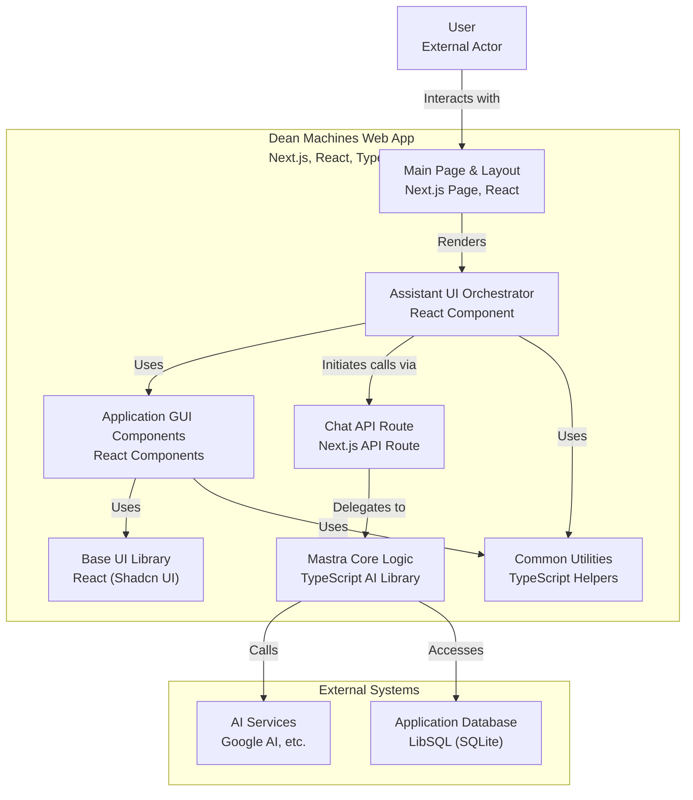

This is the [assistant-ui](https://github.com/Yonom/assistant-ui) starter project.

## Getting Started

First, add your OpenAI API key to `.env.local` file:

```
GOOGLE_GENERATIVE_AI_API_KEY="xxxxxxxxxxxxxxxxxxxxxxxxxxxxxxxxxxxxxxxxxxxxxxxxxxxxxxxxxxxx"
```

Then, run the development server:

```bash
npm run dev
# or
yarn dev
# or
pnpm dev
# or
bun dev
```

Open [http://localhost:3000](http://localhost:3000) with your browser to see the result.

You can start editing the page by modifying `app/page.tsx`. The page auto-updates as you edit the file.

